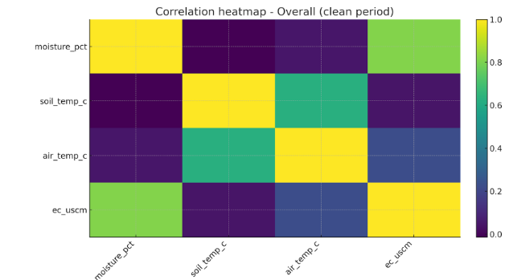
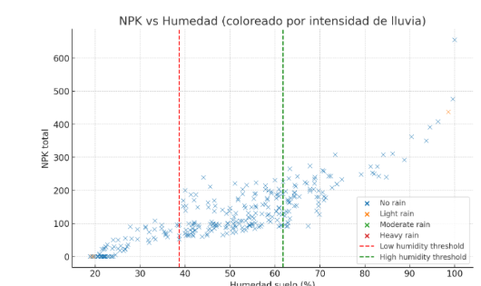

# Experiment Analysis

## Experiment in Barcelona

### Description

This experiment is part of the *Compostable Altar: Offering to the Earth* project developed with *Le Terre di Zoé*.  
The altar concept integrates regenerative agriculture and digital fabrication to return organic waste to the soil in a structured, data-observed form.  
The Barcelona setup consisted of three experimental pots:

- **Pot 1 (Control):** plain soil  
- **Pot 2:** soil mixed with clementine biomaterial  
- **Pot 3:** soil mixed with clementine + wood + micronutrients  

Sensors recorded soil moisture, temperature, EC, and nutrient concentrations every six hours (03:00, 09:00, 15:00, 21:00).  
The clean data period excludes the rain event (24 July 2025) and post–15 August, when irrigation failed.

- Sensors programmed to collect data from **03:00, 09:00, 15:00, and 21:00** (before and after irrigation).

- **[Soil_SensorLog_Excel (Google Sheets)](https://docs.google.com/spreadsheets/d/1fuXMhIeZmdkuDx-OKciJxdq_qJpYiwOjglZQunsAHkk/edit?usp=sharing)**  

- **[Grafana Dashboard](https://carmenrobresdev.grafana.net/public-dashboards/2f0d8b1b6d794fd3bea7a44c23bf50f4)**  
  *(Choose the time range to be displayed in graphs in the upper tab of the screen)*

---

## Sensor and Data Quality

The measurements in this experiment were collected using a **CWT NPK-PH-CTH-S** soil sensor connected to a **Raspberry Pi** through an **RS485 converter**.  
This setup recorded soil data continuously and saved it directly on the Raspberry Pi, giving a detailed view of changes through the day.

The sensor measures soil moisture, temperature, electrical conductivity (EC), pH, and the estimated amounts of nitrogen (N), phosphorus (P), and potassium (K).  
These nutrient readings are not direct chemical tests. Instead, the sensor estimates them from the movement of ions in the soil water.  
When the soil is wet, ions move easily, and the readings go up.  
When the soil dries, ion movement slows, and the sensor may show values close to zero even though the nutrients are still in the soil.

The pH part of the sensor works in a similar way.  
It needs moisture and a minimum level of EC to stay stable.  
After heavy rain or during long dry periods, the pH signal can drift higher or become less accurate.

---

### Limitations to keep in mind

- N, P, K readings depend on soil moisture. Very dry soil gives artificially low results.  
- Sudden wetting or rain can temporarily raise EC and NPK readings because of salt movement and dilution effects.  
- pH accuracy drops when EC is very low (for example, right after rain).  
- The sensor does not measure total nutrient content, only the nutrients currently available in the soil solution.  
- Readings can vary slightly with soil texture and temperature, so the same soil type should be used across all treatments for fair comparison.

Despite these limits, the sensor provided stable data on moisture and temperature and captured realistic trends in EC and nutrient behavior.  
For more precise studies, it is recommended to calibrate the sensor with lab soil analyses, check pH with a bench pH meter, and keep soil moisture above 30% to maintain reliable NPK readings.

---

## Results and Discussion

### Overview of Clean Period

#### 1. Pot 1 (without biomaterial)

- **pH:** average ≈ 5.4, stable between 5.2 and 5.7, slightly acidic.  
- **EC:** average ≈ 28 µS/cm, very low compared to the other pots.  
- **N, P, K:** almost all zero, consistent with the absence of an altar or nutrient supply.  

**Conclusion:** The soil remains nutrient-poor and has low conductivity.

---

#### 2. Pot 2 (lemon biomaterial)

- **pH:** average ≈ 6.1, closer to neutral, with peaks up to 7.9.  
- **EC:** average ≈ 150 µS/cm, much higher than pot 1.  
- **P and K:** there are clear increases, with P reaching 110 and K reaching 103.  

**Conclusion:** The lemon biomaterial provides nutrients and increases soil conductivity.

---

#### 3. Pot 3 (lemon + wood + micronutrients)

- **pH:** average ≈ 5.6, slightly more acidic than pot 2 but stable.  
- **EC:** average ≈ 209 µS/cm, the highest, with strong peaks (up to 670).  
- **N, P, and K:** much higher than in the other pots, with N up to 101 and P/K at very high values.  

**Conclusion:** The combination with wood and micronutrients enriches the soil the most, but it can also produce extreme peaks in EC and nutrients.  
The wood mix usually holds moisture a bit better in a pot, so you should see smoother moisture for Pot 3.

---

#### 4. Comparison

| Maceta | pH medio | EC medio | N medio | P medio | K medio |
|--------|-----------|----------|----------|----------|----------|
| 1 (sin biomaterial) | 5.4 | 28 | 0 | 0.6 | 0.3 |
| 2 (limón) | 6.1 | 150 | 0.7 | 30.6 | 23.9 |
| 3 (limón+madera+micro) | 5.6 | 209 | 9.7 | 61.1 | 54.3 |

The pH increases with lemon, but with more nutrients it remains acidic.  
EC, P, K, and N increase significantly with the biomaterial, especially in pot 3.  
The pot without biomaterial shows almost no change in nutrients.

---

When we added biomaterials (the clementine and wood mixes), the soil became richer in nutrients and more conductive (higher EC).  
EC measures how many dissolved ions are in the soil water, basically how “salty” or nutrient-dense the solution is.  
In Pot 2, the clementine mix made the soil less acidic, making pH closer to neutral. That’s a good sign for most crops, because extreme acidity limits nutrient uptake.  
In Pot 3, where wood and micronutrients were added to the clementine mix, both EC and nutrient levels rose even more.  
This means that mixture released more soluble nutrients into the soil water.  
The temporary EC peaks seen in Pot 3 right after irrigation suggest that some of those nutrients were released in a short burst like a “flush” of salts into the soil solution.  
After the flush, EC dropped again as the salts were either absorbed, diluted, or settled.

---

## Correlation Study

### Correlations observed

Typical pattern in the dataset:

- **Humidity vs soil temperature** is strongly negative: r ≈ -0.9 → Warmer hours mean drier soil.  
- **Humidity vs EC** is mostly positive: r ≈ +0.8 → When you wet a pot, ions go into solution and EC spikes.  
- **Soil temperature vs EC** tends to be negative → On hot, dry hours the sensor often reads lower EC because the ionic path is weaker.

---

### What affects NPK?

- **EC (Pot 3 analysis)** → Correlation of NPK **0.96** → More salts dissolved = more nutrients available  
- **Humidity** → Correlation of NPK **0.88** → More Humidity = more salts dissolved  
- **pH** → Correlation **0.28** → It affects the absorption of nutrients, but slightly  
- **Temperature** → No direct correlation; it influences pH slightly

---

The NPK readings from the sensors don’t directly measure the total amount of nutrients stored in the soil.  
Instead, they measure how many nutrient ions are moving in the soil water at that moment.  
When the soil is moist and ions can move freely, the sensors show higher NPK values.  
When the soil is dry, ions can’t move as well, and the readings drop, even if the nutrients are still physically in the soil.  
So the NPK data are more about **ion mobility (movement in solution)** than about **nutrient stock (what’s actually in the soil)**.  

Pot 3, with the wood mix, shows reduced amplitude of EC oscillations, meaning that the swings in EC between wet and dry cycles are smaller.  
This happens because the wood helps the soil retain water.  
With more stable humidity, EC doesn’t spike or crash as sharply.

---

## Environmental Effects

### Rain day (24 July 2025)

On the 24th of July it rained, and Pot 2’s pH jumped from 6.3 to about 8.0, while EC dropped.  
That tells us two things:

1. **Dilution effect:** Rainwater has almost no dissolved ions. When it mixes into the soil, it dilutes the soil solution, lowering the total ionic concentration (so EC goes down).  
   Many pH sensors depend on that same ionic strength to work correctly. When EC drops, these sensors often drift toward higher pH readings, even if the true pH hasn’t changed that much.  
2. **Possible leaching of acids:** The clementine material releases mild organic acids. When heavy rain flushes through, some of those acids wash away, leaving the soil temporarily less acidic (so pH rises).

So, the spike to pH 8 doesn’t mean the soil truly became alkaline — it’s mostly a temporary measurement effect caused by dilution and acid leaching.

---

### Irrigation stop (15 August 2025)

When irrigation failed for a couple of days, soil humidity dropped below 30%. Soon after, the sensor readings for N, P, and K went to zero.  
That doesn’t mean the nutrients disappeared. It means:

- In dry soil, ions can’t move, so the sensor can’t detect them.  
- The soil solution becomes so weakly conductive that nutrient sensors interpret it as “no nutrients present.”

---

## Weather Effects

Average NPK by rainfall intensity (kg/ha equivalent):

- No rain: 125  
- Light rain (<5 mm): 146  
- Moderate or heavy (>20 mm): insufficient data  

**Conclusion:** Light rain appears to increase NPK (probably by releasing nutrients from the altar), but we don't have data on heavy rains.  
In general, very heavy rains tend to wash away nutrients (leaching).

---

### Ideal Data

- **pH** around **5.5–6** (<5 or >7 have low NPK)  
- **Temperature** around **24–28 ºC**

---

### Electrical Conductivity (EC)

Average NPK by EC category:

- Low EC (<172): 28  
- Medium EC (172–266): 118  
- High EC (>266): 243

**Conclusion:** NPK is much higher when EC is high, because there are more dissolved salts.

---

### Soil Humidity

Average NPK by moisture category:

- Low moisture (<38.7%): 32  
- Medium (38.7–61.8%): 126  
- High (>61.8%): 220

**Conclusion:** High moisture (>62%) almost doubles the NPK compared to medium moisture and is seven times higher than low moisture.

---

### What it means

- **Stable humidity:** Maintain humidity within the 38–62% range, without sudden changes.  
- **Light rain:** <5 mm/day does not appear to leach nutrients. More rain could lower them.  
- **High EC:** >266 µS/cm indicates soil with plenty of available nutrients.  

The data show that days with regular irrigation maintain humidity in the mid-high range, which stabilizes NPK.  
When irrigation fails, humidity drops, and NPK also decreases.  
Simple idea: **more humidity = more dissolved ions = higher EC = higher measured NPK.**

---

## Cycles in the data

### Day vs night

Hourly means show a clear pattern for every pot:

- Soil temperature peaks mid-afternoon.  
- Moisture is lowest around the same time.  
- As soils cool and rewet, EC rises after falling during the warmest, driest hours.

---

### Irrigation cycle

We marked irrigation-like events as the top 10 percent moisture jumps. Around those times you see:

- A sharp moisture rise, then a decay over hours to days.  
- EC jumps right after wetting, then drifts down.  
- A small temperature dip if the water was cooler.

---

### Start vs end comparison

To assess changes over time, we compared the first seven days of the clean data period with the final seven days before the irrigation fault.  
The trends were clear across all treatments.

- **Pot 2 (Clementine):** showed higher EC at the end of the experiment, particularly after irrigation events. This indicates continued release of soluble compounds over time.  
  This pot provides quick nutrient availability but can cause sharp EC peaks.  
  In open-field conditions, these peaks would likely wash out faster, reducing salt buildup.  

- **Pot 3 (Wood + Clementine):** maintained more stable moisture levels and smaller EC fluctuations.  
  The addition of wood helped retain water and moderate salt concentration swings, producing a more balanced soil environment.  
  This stability benefits plant roots during hot, dry periods and reduces physiological stress.  

- **Pot 1 (Control):** remained lowest in EC throughout the experiment and reflected natural temperature and irrigation cycles without influence from biomaterials.  

**Overall conclusion:**  
The clementine-only treatment promotes rapid nutrient release, while combining wood with clementine slows the release and reduces salt and moisture stress.  
Maintaining soil moisture between **38–62%** keeps nutrient readings stable.  
Below **35%**, sensor readings lose accuracy.  
EC above **266 µS/cm** corresponds to the most nutrient-rich conditions.

---

## Conclusion

The results demonstrate that fruit-based biomaterials can enrich soil and measurably change its electrochemical properties.  
Their influence appears immediately after irrigation, shown by sharp increases in EC and NPK readings.  
Adding wood powder moderates these reactions, helping the soil retain moisture and nutrients more evenly.

The rain and irrigation fault events clearly show that soil-water balance is the main driver of both nutrient availability and pH behavior.  
When soil moisture falls, nutrient ions become less mobile, and sensor readings drop, even though the nutrients remain in the soil.  
When moisture rises again, ion movement resumes, and nutrient values recover.

### Future research should:

- Include controlled drainage tests to distinguish true nutrient release from sensor-related effects.  
- Combine sensor data with laboratory chemical analyses for accurate calibration.  
- Extend experiments to open-field conditions to evaluate how leaching, microbial activity, and weather cycles influence the performance of these biomaterial treatments.
