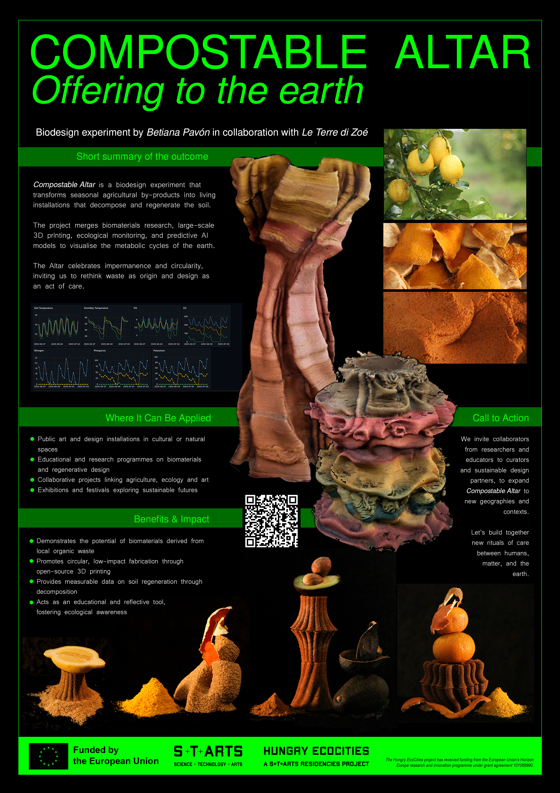

**Designing to Disappear**

In the age of climate emergency, ecosystem degradation, and widespread resource depletion, contemporary design faces a critical turning point. No longer can we afford to create objects for permanence or mass production without questioning their impact on living systems. Design must shift toward a paradigm that embraces transience, material responsibility, and ecological reciprocity. The project Compostable Altar: Offering to the Earth arises from this moment of redefinition. It proposes a new type of design gesture—one that centers decomposition not as a failure of durability, but as a regenerative strategy, celebrating life cycles and impermanence.

As global food systems face unprecedented challenges, from climate change to population growth, global food systems face unprecedented challenges, which ask for local actions. Benton et al. (2021) highlight the significant impact of our food systems on biodiversity loss. Jayati Ghosh (2023) argues that the global food system is fundamentally broken, highlighting the urgent need for innovative solutions. With this in mind, biodesign can offer a way forward and Hungry EcoCiteis provide experimental grounds to explore how.

At its core, the altar is a biodegradable installation situated in rural areas. Constructed from organic residues and local biodegradable materials coming from the orchard farming, it is intentionally designed to disintegrate and return to the soil - to feed the soil. This act of disappearing is not accidental or secondary—it is intrinsic to the work’s symbolic and ecological function. Through this process, the altar nourishes the same landscape it temporarily inhabits, becoming both a sculptural offering and a biological event.

