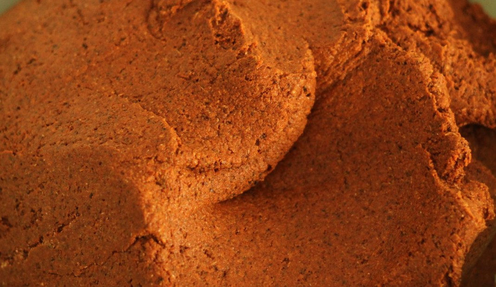
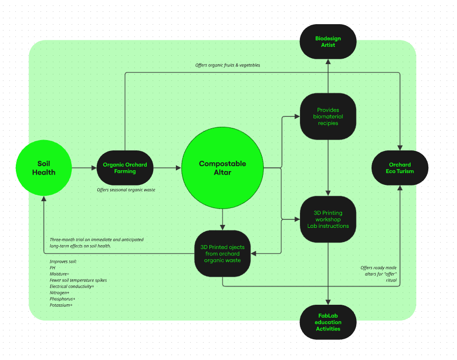

**Biomaterials**

The physical construction of the altar is rooted in a research-led approach to material innovation. It is composed entirely of experimental biomaterials derived from locally sourced organic waste—primarily agricultural by-products such as vegetable fibers, citrus peels, and pulp discarded from regional juice production. These organic residues are combined with natural binders like starches, alginates, and plant-based gums & micro-nutrients creating a biodegradable and compostable composite material that interacts dynamically with its environment.

Beyond its technical exploration, the development of these biomaterials was conceived as a participatory framework. The project also extends towards the farming community: by sharing methods for incorporating local residues, seeds and nutrients into new composites, it invites farmers to imagine their own rituals of return and regeneration. In this sense, materiality becomes not only a medium of artistic expression, but also a pedagogical and communal tool, empowering diverse actors to reinterpret the altar according to their ecological and cultural contexts.

