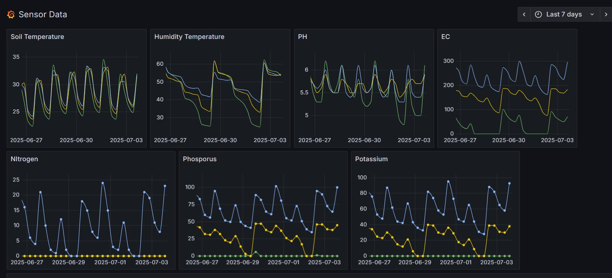

**Ecological Monitoring as Expanded Aesthetics**

As part of the altar’s lifecycle, an ecological monitoring system was developed and deployed during both its installation and decomposition phases. This system includes a combination of sensors that measure soil humidity, temperature, PH, Electroconductivity, Nitrogen, Phosphorous, Potassium and microclimatic conditions, along with continuous photographic and video documentation. These tools not only capture environmental data but also trace the material transformations of the altar itself as it undergoes natural breakdown, becoming one with the soil. This continuous observation turns the altar into a living laboratory—an open experiment where organic decay and technological observation intersect.

The data collected is not relegated to backend analysis or scientific abstraction; instead, it is integrated into the aesthetic and conceptual framework of the project. Visualizations of the sensor outputs—graphs, heat maps, time-lapse footage—are archived and exhibited as extensions of the altar’s narrative. These forms of representation construct a temporal cartography of the altar’s metabolism, rendering visible the usually imperceptible processes of decomposition, soil response, and climatic interaction. While this phase of the project focused on a pilot installation, preliminary soil analyses already suggest that the altar’s decay can enhance soil quality. This opens a fertile direction for future research: to test the altar’s influence on soil growth at larger scales and in-field conditions, in collaboration with farmers, scientists and design students, exploring how ritual artefacts might become active agents within regenerative practices.

