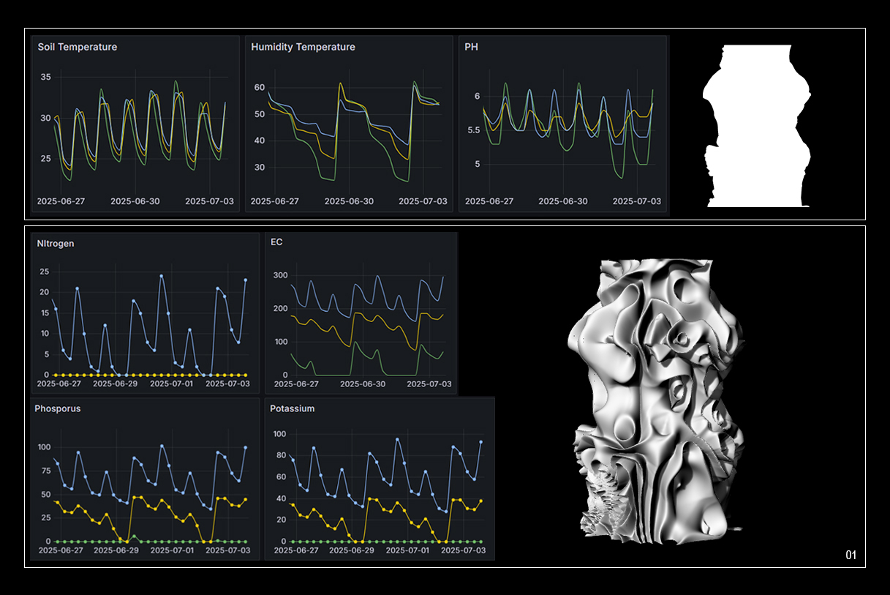
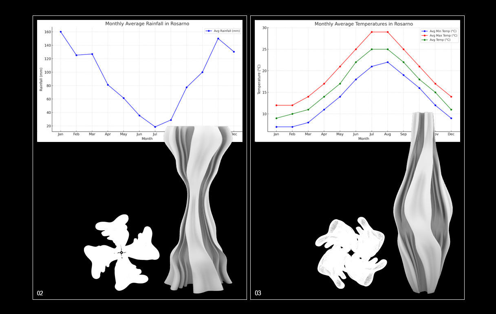

**Data-driven morphological design following ecological monitoring**

In this stage of the project, the altar was conceived as a set of three totemic towers. The choice of a totemic language responds to both symbolic and ecological dimensions. Within totemism, human groups identify and represent themselves through natural symbols that embody ties of origin, power and collective identity. Reinterpreted through biodesign, the totem here becomes a device that inscribes environmental data and metabolic processes into ritual and biodegradable geometries.

_Totem 01 — Biomaterial-soil interaction_

Based on the most efficient recipe (made from lemon peel powder, wood, micronutrients, and seeds), this totem integrates seven layers of data from the Barcelona experiment. The base structure was defined using parameters linked to local climate cycles (soil temperature, humidity, and pH), while the surface texture was generated using (Voronoi noise), a procedural algorithm that translated electrical conductivity (EC), nitrogen, phosphorus, and potassium into irregular organic patterns. The resulting roughness symbolizes the metabolic interaction between the biomaterial and the soil in its decomposition process.

_Totem 02 — Rainfall calendar_

This tower is based on monthly average rainfall data from Rosarno (the town nearest to the farm). Months with greater precipitation are expressed through volumetric expansions and open perforations, while drier months result in narrower diameters. By mapping rainfall curves over the course of a full year, the totem translates two-dimensional climate graphs into a three-dimensional morphology that materialises the seasonal cycles of water.

_Totem 03 — Thermal calendar_ 

Using the same base geometry as Totem 02, this tower is altered according to monthly average temperature data from Rosarno. Higher values are translated into larger diameters and more open geometries, while lower temperatures generate denser and more compact forms. In this way, the totem becomes a climatic calendar that embodies the rhythms of heat and cold across the annual cycle.

