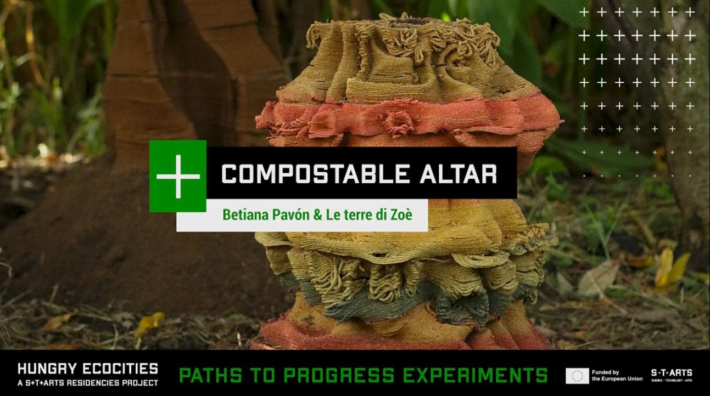

# Compostable-Altar-offering-to-the-earth
_Compostable Altar_ is a research-based art and design project exploring the intersection between material experimentation, digital fabrication, and ecological intelligence. Developed during the Hungry EcoCities – S+T+ARTS Paths to Progress Experiment in collaboration with the agricultural enterprise Le Terre di Zoé (Calabria, Italy), the project investigates how biodegradable materials derived from organic waste can regenerate soil health while embodying cultural and ritual meaning.

The altar functions simultaneously as a sculpture, a living system, and a data-driven prototype. It was 3D-printed using large-scale open-source fabrication technologies and custom biomaterials made from local agricultural by-products such as citrus residues. Throughout its installation, environmental sensors monitored soil conditions—temperature, pH, humidity, electrical conductivity, and nutrient dynamics—creating a feedback loop between decomposition and regeneration.

By merging artistic inquiry with scientific observation, Compostable Altar proposes a new approach to regenerative design—one where decay is not failure, but transformation. It envisions circular practices in which matter, data, and ritual converge to form new narratives of care and sustainability.

This open repository aims to share methodologies and invite further experimentation, enabling others—designers, researchers, farmers, and educators—to replicate, adapt, or extend the project in new ecological and cultural contexts.

-

This project is developed by _Betiana Pavón_ in collaboration with the organic farm _“Le Terre di Zoè”_ as part of the _Hungry EcoCities_ initiative _STARTS.eu._

Mentored by _In4Art_, _Mendel University_ & _Studio Other Spaces_.-

_The Hungry EcoCities project has received funding from the European Union’s Horizon Europe research and innovation programme under grant agreement 101069990._

-
Key collaborators in this project
 
- _Andres Vazquez_, Agricultural Engineer Advisor
- _Carmen Robres de Veciana_, Electronics & AI Researcher
- _Mateus Sartori_, Parametric coding Grasshopper
- _Jet Clay_, open-source 3D printing development
